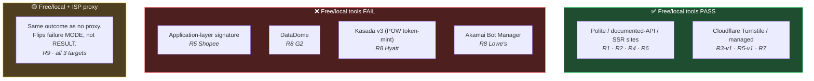

# Calibrated ceiling — per-round evidence

Nine rounds of benchmark evidence establishing where the thesis works and where it genuinely stops.

## Round-by-round summary

| # | Target | Protection class | Tools tested | Outcome | Key finding |
|---|---|---|---|---|---|
| 1 | CoinMarketCap top-100 | None — Next.js SSR with `__NEXT_DATA__` | A/B/C/D (4 tools) | ✅ 4/4 extracted | Fetch MCP wins on friction; SSR data > browser |
| 2 | Binance top-100 USDT | SPA + documented REST + internal XHR + SSR `__APP_DATA__` blob | A/B/C/D/E/F (6 tools) | ✅ 6/6 extracted | Scrapy ties Fetch MCP (framework hygiene for free) |
| 3 | scrapingcourse/cloudflare-challenge (sandbox) | Cloudflare Turnstile managed | 6 generalist anti-bot tools | ❌ **0/6 bypassed** | Generalist tools fail; need protection-specific |
| 4 | scrapingcourse/ecommerce (sandbox) | None | web-scraper skill × Scrapy synthesis | ✅ 188/188, 29/30 lifecycle | **Synthesis > either alone**. Pipeline caught a real bug mid-run. |
| 5-v1 | Same CF sandbox | Cloudflare Turnstile managed | web-scraper skill × Scrapling | ✅ 1/1 bypassed | `StealthyFetcher(solve_cloudflare=True)` clears it in ~20 s |
| **5** | **Shopee** (real retail) | **Application-layer** — session signatures + device telemetry + IP reputation | skill × Scrapling (full thesis) | **❌ 0 products** | Silent login redirect. Two attempts; the thesis-faithful one captured 62 XHRs + error `90309999` + fingerprint-telemetry endpoint. |
| 6 | Substack (ACX) | None — public `/api/v1/posts` | Full thesis | ✅ 30/30 in 5 s | Phase 0 alone delivered everything |
| **7** | **BlackHatWorld** (real forum) | **Cloudflare managed** (same class as R3 sandbox) | skill × Scrapling | **✅ 24 validated threads** | **Sandbox CF trick transfers to real production.** Same ~20 s solve. |
| 8 | G2 / Hyatt / Lowe's (3× parallel) | DataDome / Kasada / Akamai | Full thesis × 3 agents | ❌ 0/3 all blocked | 3 different failure modes — each matches industry benchmarks |
| 9 | Shopee + G2 + Lowe's with ISP proxy pool | Same as R5 / R8 | Full thesis + proxy rotation | 🟡 flips failure mode (edge-block → challenge served) but **outcomes unchanged** | Datacenter-ISP proxy ≠ residential; Akamai actually WORSE with bad-ASN proxy |

## The calibrated boundary

## Diagnostic signatures (from honest failure reports)

### Shopee (app-layer) — R5 + R9
- HTTP 200 SPA shell always served; products never in HTML
- `/api/v4/search/search_items` returns `error: 90309999` ("suspected bot") with tracking_id
- Silent 302 redirect to `/buyer/login?fu_tracking_id=...&next=...` — no visible challenge
- Fingerprint-telemetry exfil to `df.infra.shopee.sg/v2/shpsec/web/report`
- 14-cookie warm session + CSRF token + all Sec-Fetch-* headers STILL returns 403

### DataDome (G2) — R8 + R9
- Edge-level `x-datadome: protected` + `x-dd-b: 2` + `x-datadome-cid: ...` headers
- Body: `
Please enable JS and disable any ad blocker
`
- Proxy flips edge-block → DataDome challenge iframe at `geo.captcha-delivery.com` with `t=fe` (full enforcement)
- Still unsolvable without CAPTCHA solver

### Kasada (Hyatt) — R8
- Akamai TLS layer gatekeeps Kasada's delivery (E6020 dead-end if TLS fails)
- Kasada shell: 842 B with `window.KPSDK={}` and `/{UUID}/*/ips.js?...&x-kpsdk-im=AAIk...`
- Requires `x-kpsdk-ct` / `x-kpsdk-cd` tokens minted by solving the POW challenge
- NO open-source POW solver exists anywhere (as of 2026-04-22)

### Akamai Bot Manager (Lowe's) — R8 + R9
- `akamai-grn` header, `server-timing: ak_p; desc="..."` on every response
- E6020 "Access Denied" block page for rejected requests (~450 B)
- `_abck` sensor-cookie challenge from `/SZrnEFaAqVDtZY6zWkp5/.../sensor_data`
- Category-URL-specific: curl_cffi safari18_0 gets 200+sensor where chrome131 gets 403
- Browser fingerprint detection catches Camoufox, patchright, raw Playwright UPSTREAM of the sensor

### Cloudflare managed/Turnstile — R3 sandbox, R5-v1, R7 BHW (clearable)
- `server: cloudflare`, `cf-mitigated: challenge`, `cType: 'managed'`
- Body: `<title>Just a moment...</title>` + `_cf_chl_opt` + `/cdn-cgi/challenge-platform/...`
- **Scrapling `solve_cloudflare=True` clears in ~20 s on both sandbox and production (R7)**

## Industry corroboration

[Proxyway Web Scraping API Report 2025](https://proxyway.com/research/web-scraping-api-report-2025) tested 11 paid APIs × 15 protected targets:

- Shein (in-house): 21.88% paid-API avg success
- G2 (DataDome): 36.63%
- Hyatt (Kasada): 43.75%
- Lowe's (Akamai): 52.57%

That our free-tier stack fails on targets where even the paid tier averages 36-52% is expected. Industry evidence: **Scrapfly maintains 98%**, **ZenRows 58-70%**, **Bright Data / Zyte / Oxylabs are the "heavyweights" for Kasada/DataDome/PerimeterX**. Paid Tier C is a real category.

## Reading the thesis evidence

- Full essay: `../../../../essay_deep_dive.md` (8,000 words)
- Per-round scorecards: `../../../../evaluation_r*/scorecard.md`
- Per-round mechanism reports: `../../../../evaluation_r*/results/*/mechanism.md`
- Hard-target research memo: `../../../../research/hard_targets_2026.md`
